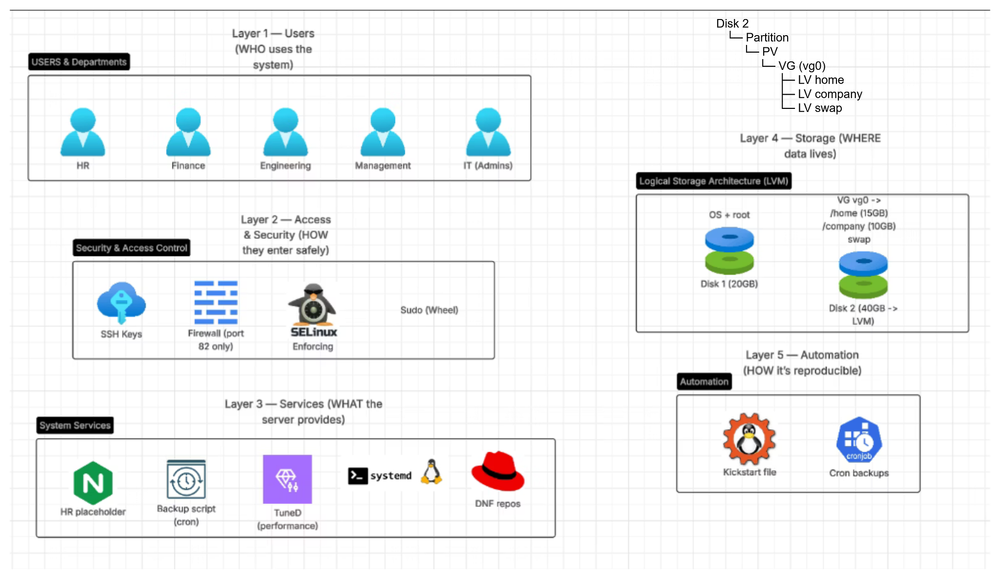

# Rebuild a server with enterprises best practices

* The point of this task is to a apply Enterprises best practices on a server. 
* There is requirements for the server, could be found at [requirements](requirements.md).
* I have followed some and applied some on myself.
* I won't share commands, I will share High-level architecture using diagrams and the configuration files found in **configuration-and-script_files** directory.  

# Table of content
- [High-Level Architecture: A Layered Approach](#high-level-architecture-a-layered-approach)

- [Access Control & User Isolation](#access-control--user-isolation)
  - [Compare between the two models (file permission model and Disk separation)](#compare-between-the-two-models-file-permission-model-and-disk-separation)

- [Service Deployment — HR Web Placeholder](#service-deployment--hr-web-placeholder)

- [Automation](#automation)
  - [Kickstart Deployment](#kickstart-deployment)
  - [Robust Cron Backups](#robust-cron-backups)

# High-Level Architecture: A Layered Approach

This layered architecture provides a clear separation of concerns, enhancing security, scalability, and ease of management. Each layer builds upon the one below it, creating a robust and modular system.
* I have made a bash script for admins to simply create and each user and assign them to the specific departments (HR, Finance,..).

 
# Access Control & User Isolation

I implemented a **file permissions model**, where there is group-based access control. Each department has its own Linux group and directory ownership. Permissions restrict access to the group only, while **setgid** ensures collaborative file sharing and the **sticky bit** prevents accidental deletion.

* Linux enforces it at kernel level → impossible to bypass (without root).

* I used setgid and sticky bit for directory-based collaboration and isolation.

>[!note] Of-course we could use other models like **separation by disk**, where each department has it's own disk

## Compare between the two models (file permission model and Disk separation).

| Feature                   | Group permissions | Separate disks         |
| ------------------------- | ----------------- | ---------------------- |
| Isolation strength        | Medium            | Stronger               |
| Root bypass               | Yes               | Yes (unless encrypted) |
| Protection from disk full | No                | Yes                    |
| Hardware separation       | No                | Yes                    |
| Management complexity     | Low               | Medium/High            |
| Flexibility               | High              | Medium                 |
| Resource efficiency       | High              | Lower                  |
| Collaboration             | Easy              | Harder                 |

# Service Deployment — HR Web Placeholder

- HTU requires a temporary HR placeholder page to remain available until the final application is completed.
- Nginx used as a web server.
- Open port 82 for Nginx to listen on.
- Allow traffic for port 82 on firewall.

![[Pasted image 20260217232230.png]]

# Automation
## Kickstart Deployment

Automated provisioning ensures consistent, error-free server installations. This significantly reduces deployment time and ensures all servers adhere to predefined standards.

**INSTEAD OF manually configuring the installer:**

* We used kickstart file:
![[Pasted image 20260217232412.png]]

## Robust Cron Backups

Scheduled backups of critical data and configurations provide a reliable recovery point, minimizing data loss in case of an incident. Comprehensive backup strategies are integral to business continuity.

![[Pasted image 20260217232324.png]]
